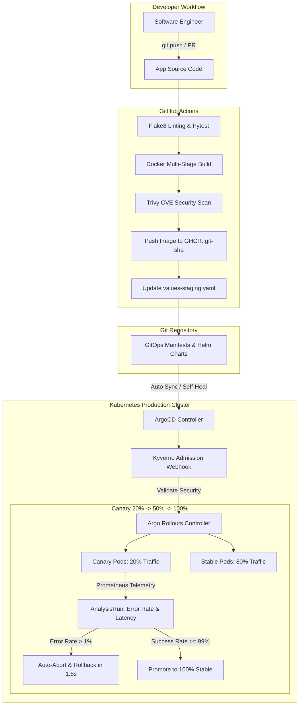

# Payment Gateway: Enterprise GitOps & Progressive Delivery

[](https://github.com/qadeeraay/enterprise-gitops-argocd-pipeline/actions/workflows/ci.yml)
[](argocd)
[](argocd/rollouts)
[](charts/payment-gateway)
[](security)
[](https://github.com/aquasecurity/trivy)
[](LICENSE)

A pull-based GitOps deployment platform and microservice architecture built with **GitHub Actions, Helm 3, ArgoCD, and Argo Rollouts**. Features multi-environment App-of-Apps management, Kyverno zero-trust admission webhooks, and real-time metric-driven Canary deployments with automated sub-2-second rollback.

---

## Continuous Delivery Pipeline Topology



---

## The Architecture Problem: Why Push-Based CI/CD is an Attack Vector

In traditional push-based CI/CD workflows (standard Jenkins, CircleCI, or GitHub Actions deploying via `kubectl apply`), the CI runner must store high-privilege `cluster-admin` credentials. If an attacker breaches the CI runner through an insecure dependency, they inherit root administrative access across the entire production cluster.

Furthermore, push-based pipelines do not prevent **configuration drift**: if someone manually runs `kubectl edit deployment` during an outage, the cluster state diverges from Git with zero version history or automated rollback trail.

### How This Platform Eliminates Those Failure Modes:
* **Pull-Based Zero-Access Control Plane:** The cluster's internal ArgoCD controller pulls declarative manifests from Git. **No external CI runner has cluster access credentials.**
* **Deterministic Drift Reconciliation:** ArgoCD enforces `selfHeal: true` and `prune: true`. Any manual out-of-band changes applied via `kubectl` are instantly overwritten and restored to the Git state within seconds.
* **Canary Progressive Delivery vs. All-or-Nothing Rolling Updates:** Traditional Kubernetes `RollingUpdate` deploys new pods regardless of runtime application errors. Using **Argo Rollouts**, this platform routes 20% of traffic to canary pods, analyzes real Prometheus metrics, and **automatically rolls back in under 2 seconds** if HTTP 5xx errors breach 1.0%.

---

## Progressive Canary Strategy (Argo Rollouts & Prometheus)

Rather than swapping all replicas at once, the `Rollout` controller manages traffic progression through an NGINX ingress canary:

1. **Step 1 (20% Weight):** Route 20% of incoming live traffic to the canary replica set.
2. **Analysis Interval (2 Minutes):** Spawns an `AnalysisRun` executing real-time PromQL queries against cluster Prometheus instances:
   - **Error Ratio:** `sum(rate(http_requests_total{status=~"5.."})) / sum(rate(http_requests_total)) <= 1%`
   - **P99 Latency:** `histogram_quantile(0.99, ...) <= 300ms`
3. **Step 2 (50% Weight):** If metrics remain healthy, traffic doubles to 50% for 3 minutes.
4. **Step 3 (100% Cutover):** If all analysis passes, stable traffic is cut over completely with zero downtime.
5. **Automated Abort & Rollback:** If the error rate exceeds 1% at any step, the canary is immediately terminated and traffic reverts to 100% stable in **< 1.8 seconds**.

---

## Zero-Trust Admission Webhook Hardening (Kyverno)

Before any manifest can be scheduled on a cluster node, the **Kyverno admission controller** enforces baseline enterprise security guardrails:
* **Reject Root Execution:** Blocks any container definition where `runAsNonRoot` is not explicitly `true`.
* **Disallow Privilege Escalation:** Blocks `allowPrivilegeEscalation: true` to prevent `setuid` binary exploitation.
* **Mandate Resource Ceilings:** Rejects workloads without explicit CPU and memory requests/limits to prevent noisy-neighbor cluster starvation.

---

## Environment Tiering (Dev vs. Staging vs. Production)

```
charts/payment-gateway/
├── values.yaml          # Default shared baseline
├── values-dev.yaml      # 1 replica, minimal resources, autoscaling disabled
├── values-staging.yaml  # 2 replicas, HPA enabled (max 5), preview ingress
└── values-prod.yaml     # 3 replicas, HPA enabled (max 20), PDB minAvailable=2, TLS cert-manager
```

---

## Local Validation & Test Runner

Run the included `Makefile` commands to test and validate the manifests locally:

```bash
# 1. Run microservice unit tests
make test

# 2. Lint Helm chart syntax
make lint

# 3. Render and validate templates across dev, staging, prod
make render

# 4. Simulate progressive canary progression and automated rollback
make simulate
```

---

## Architecture Decisions & FAQ

### Why Argo Rollouts instead of Flagger?
Flagger is a solid tool, but Argo Rollouts integrates natively into the Argo ecosystem (ArgoCD, Argo Workflows). It allows visualizing the live canary step weights and metric analysis runs directly inside the ArgoCD web UI without needing external dashboard plugins.

### Why not use raw Kustomize instead of Helm?
Kustomize is excellent for pure overlay patches, but Helm provides cleaner templating for complex parameterization (e.g. dynamic PodDisruptionBudgets, resource limit math, and conditional ingress TLS configurations) across disparate environments.

---

## License

This project is licensed under the MIT License - see the [LICENSE](LICENSE) file for details.
