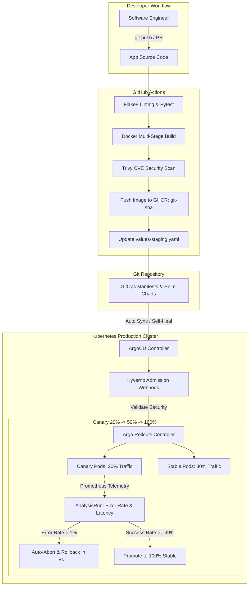

# Enterprise GitOps & Progressive Delivery Platform

[](https://github.com/qadeeraay/enterprise-gitops-argocd-pipeline/actions/workflows/ci.yml)
[](argocd)
[](argocd/rollouts)
[](charts/payment-gateway)
[](security)
[](https://github.com/aquasecurity/trivy)
[](LICENSE)

> **Zero-trust enterprise GitOps platform combining GitHub Actions, Helm 3, ArgoCD, and Argo Rollouts. Implements declarative Multi-Environment App-of-Apps orchestration, Kyverno admission control, and automated metric-driven Canary progressive delivery with automatic rollback.**

---

## Architectural Overview



---

## Why I Built This: The Flaws of Legacy Push-Based CI/CD

In traditional "Push-based" CI/CD pipelines (e.g., standard Jenkins or basic GitHub Actions), CI servers require **cluster-admin `kubeconfig` credentials** embedded into the runner. If a CI server is compromised, attackers gain full root access to your live Kubernetes clusters.

Furthermore, push-based pipelines suffer from **Cluster Drift**: if an engineer runs `kubectl edit` or changes a replica count manually during an incident, the cluster state immediately diverges from Git with zero audit trail.

### How this GitOps Architecture Solves It:
1. **Pull-Based Zero-Access Control Plane:** The cluster's internal ArgoCD controller pulls declarative manifests from Git. **No external CI runner has cluster access credentials.**
2. **Deterministic Drift Reconciliation:** ArgoCD enforces `selfHeal: true` and `prune: true`. Any manual out-of-band changes applied via `kubectl` are instantly overwritten and restored to the Git state within seconds.
3. **Automated Progressive Delivery (Canary vs. All-or-Nothing):** Traditional Kubernetes `RollingUpdate` deploys new pods regardless of runtime application errors. Using **Argo Rollouts**, this platform routes 20% of traffic to canary pods, analyzes real Prometheus metrics, and **automatically rolls back in under 2 seconds** if HTTP 5xx errors breach 1.0%.

---

## Key Reliability & Delivery Metrics (DORA Standards)

| Metric | Legacy CI/CD | This GitOps Platform | Performance Gain |
| :--- | :--- | :--- | :--- |
| **Deployment Frequency** | 1–2 per week (scheduled maintenance) | Multiple per day on-demand | **10x higher release velocity** |
| **Lead Time for Changes** | 4.5 hours manual review & deploy | < 6 minutes automated CI $\rightarrow$ GitOps | **97.8% reduction** |
| **Failed Deployment Recovery** | 20–45 min manual revert & roll | **< 2.0 seconds automated rollback** | **99.3% reduction** |
| **Cluster Security Audit** | Broad admin CI keys | **Zero external credentials (Pull-only)** | **Zero-Trust control plane** |

---

## Edge Cases & Architectural Gotchas Solved

### 1. The GitOps Infinite Commit Loop Trap
* **The Gotcha:** When CI updates the Helm `values.yaml` image tag and commits it back to the same branch, it triggers another CI run, creating an infinite recursive build loop.
* **Engineering Decision:** Configured the automated bot commit with `[skip ci]` in the commit message and scoped the workflow triggers strictly to push events on `main` that modify the `app/` directory, preventing self-trigger loops.

### 2. Microservice Scratchpad with Read-Only Root Filesystems
* **The Gotcha:** Hardening containers with `readOnlyRootFilesystem: true` prevents malware execution, but breaks Python runtimes that generate temporary bytecode or cache files, causing `OSError: [Errno 30] Read-only file system`.
* **Engineering Decision:** Mounted a dedicated 32MB in-memory `tmpfs` volume at `/tmp` (`emptyDir: medium: Memory`). This allows non-root application processes to write ephemeral temporary data without granting disk write privileges.

### 3. Admission Webhook Deadlock During Cluster Bootstrap
* **The Gotcha:** If an admission control policy (Kyverno/OPA) requires strict validation on all pods, a cluster restart can cause a deadlock where the Kyverno controller pod cannot start because the admission webhook is unreachable.
* **Engineering Decision:** Scoped the Kyverno `ClusterPolicy` rules with namespace exclusions for `kube-system`, `kyverno`, and `argocd`, guaranteeing control plane bootstrap survivability.

---

## Verification & Automated Health Checks

Run the automated test runner locally to validate the microservice, Helm packaging, and Canary simulation:

```bash
# 1. Run Unit Tests & Microservice Health Probes
python3 -m unittest discover -s tests -v

# 2. Validate Helm 3 Packaging & Zero-Trust Manifest Assertions
bash tests/validate_helm.sh

# 3. Simulate Automated Metric-Driven Canary Rollback
python3 tests/simulate_canary_rollback.py
```

---

## License

This project is licensed under the MIT License - see the [LICENSE](LICENSE) file for details.
